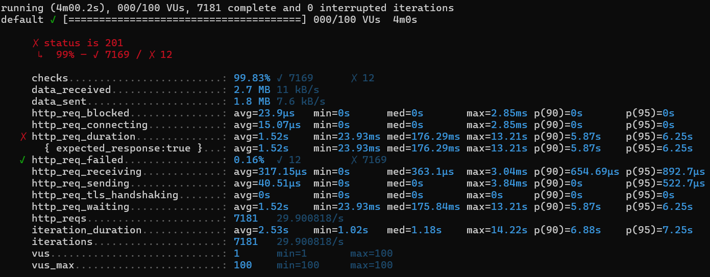
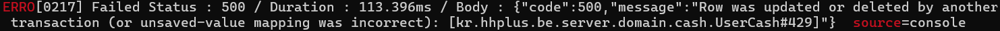
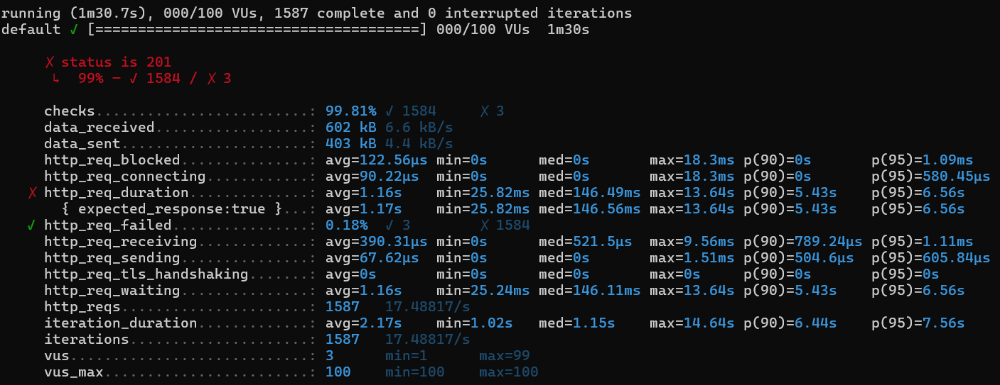

# 주문 API 부하 테스트 및 장애 대응 보고서

## 1. 목적
서비스 배포 시 예상치 못한 트래픽 집중 상황에 대비하여,
`API의 안정성과 성능을 사전에 점검`하고 `시스템의 병목 구간을 사전 파악`하기 위해서<br>
K6를 사용하여 부하 테스트를 진행하고자 합니다.

## 2. 대상
테스트 대상은 다음과 같습니다
> 주문 + 결제 API: `핵심 비즈니스 로직`으로, 재고 감소/쿠폰 적용/결제 등 다양한 처리가 포함됩니다

## 3. 테스트 설계
두 가지 상황을 가정하여 부하 테스트를 진행합니다.

- 일반적인 상황: 사용자가 꾸준히 유입되는 정상 트래픽 시나리오
- 이벤트 상황 (예: 블랙 프라이데이): 짧은 시간에 요청이 폭발적으로 증가하는 스파이크 트래픽 시나리오

이 두 상황을 바탕으로
- 지속적인 부하 테스트 (Load Test)
- 급격한 트래픽 증가 테스트 (Spike Test)

를 병행하여 시스템의 한계와 회복 능력을 검증할 예정입니다.

### 3-1. 테스트 Request 구성
- 사용자 데이터
    - 1~500번까지의 사용자 ID를 보유
    - 각 요청마다 사용자 ID를 랜덤 선택
- 상품 데이터
  - 5개의 상품 ID 보유
  - 각 주문 요청마다 1~3개의 상품을 랜덤 조합하여 주문
  - 주문 상품의 수량도 랜덤(1~5개)로 설정 가능
  
100명의 유저 아이디를 랜덤으로 배치
100개의 상품 중 주문 상품을 주문 당 상품을 랜덤으로 1-3개 배치

### 3-2. 부하 시나리오
### ✅ 지속적인 부하 테스트 (Load Test)
- 실제 사용자가 지속적으로 유입되는 상황을 테스트
```javascript
    stages: [
        { duration: '1m', target: 100 }, // 1분간 100명까지 증가
        { duration: '2m', target: 100 }, // 2분간 100명 유지
        { duration: '1m', target: 0 },   // 1분간 0으로 감소 (쿨다운)
    ]
```
- 목표
  - 시스템이 100명 동시 사용자 수준에서 얼마나 안정적으로 버틸 수 있는지 확인
  - TPS 및 응답 시간(p95, p99)의 안정성 여부 판단

### ✅ 급격한 트래픽 증가 테스트 (Spike Test)
- 짧은 시간 안에 트래픽이 급증했다가 급감하는 트래픽 스파이크 상황을 테스트
```javascript
    stages: [
        { duration: '30s', target: 10 },   // 초기 워밍업 (정상 트래픽)
        { duration: '30s', target: 100 },  // 30초 동안 갑작스러운 부하 상승
        { duration: '30s', target: 0 },    // 부하 급감 (회복 구간)
    ]
```
- 목표
  - 트래픽 급증 상황에서 안정적으로 응답을 제공하는지 확인
  - TPS 및 응답 시간(p95, p99)의 안정성 여부 판단

## 4. K6 스크립트 예시
```javascript
import http from 'k6/http';
import { check, sleep } from 'k6';

export const options = {
  //Load Test
  stages: [
    { duration: '1m', target: 100 },
    { duration: '2m', target: 100 },
    { duration: '1m', target: 0 },
  ],
  //Spike Test
  // stages: [
  //     { duration: '30s', target: 10 },    // 워밍업
  //     { duration: '30s', target: 100 },   // 30초 동안 급격한 부하 증가 (스파이크)
  //     { duration: '30s', target: 0 },     // 30초 동안 부하 급감
  // ],
  thresholds: {
    http_req_duration: ['p(99)<200'],
    http_req_failed: ['rate<0.01'],
  },
};

function getRandomInt(min, max) {
  return Math.floor(Math.random() * (max - min + 1)) + min;
}

//주문 항목(OrderItem) 리스트 생성 (1~3개 상품, 랜덤 수량)
function generateOrderItems() {
  const itemCount = getRandomInt(1, 3); // 주문 항목 개수 (1~3개)
  const items = [];

  for (let i = 0; i < itemCount; i++) {
    items.push({
      productId: getRandomInt(1, 5),  // 상품 ID (1~5번 중 랜덤)
      quantity: getRandomInt(1, 5),   // 수량 (1~5개)
      price: 1,                       // 가격 (고정값 1)
    });
  }

  return items;
}

export default function () {
  const url = 'http://localhost:8080/api/v1/orders';

  const payload = JSON.stringify({
    userId: getRandomInt(1, 500),       // 사용자 ID (1~500 중 랜덤)
    orderItems: generateOrderItems(),   // 주문 항목
  });

  const params = {
    headers: {
      'Content-Type': 'application/json',
    },
  };
  const res = http.post(url, payload, params);

  // 응답 상태 코드가 201인지 확인
  const success = check(res, {
    'status is 201': (r) => r.status === 201,
  });

  // 요청 실패 시 로그 출력 (응답 코드, 응답 시간, 응답 본문)
  if (!success) {
    console.error(`Failed Status : ${res.status} / Duration : ${res.timings.duration}ms / Body : ${res.body}`);
  }
}
```
## 5. 부하 테스트 결과
### 5-1. 지속적인 부하 테스트 (Load Test)


| 지표 항목               | 값                    |
|------------------------|-----------------------|
| 성공률                 | 99.83%                |
| 실패율                 | 0.16%                 |
| 평균 응답 시간         | 1.52s                 |
| 최대 응답 시간         | 13.21s                |
| P90 응답 시간          | 5.87s                 |
| P95 응답 시간          | 6.25s                 |
| TPS (처리율)           | 29.90 req/s (최대 100 VUs 기준) |

#### 🔥 실패 원인

- 주문 및 결제 API 내부에서 `잔액 차감 시 재시도를 하지 않는 낙관적 락`을 적용했습니다 
- 랜덤으로 생성한 `500개의 사용자 ID 중 중복이 발생`했고, `동시에 동일 사용자의 잔액을 차감하려는 요청이 충돌`하여 에러가 발생했습니다
<br>=> API의 문제라기보다는 `테스트 데이터 구성의 문제로 인해 발생`한 것이므로 해당 문제는 `테스트 결과 분석 대상에서 제외`하기로 했습니다.

### 5-2. 급격한 트래픽 증가 테스트 (Spike Test)


| 지표 항목               | 값                           |
|------------------------|-----------------------------|
| 성공률                 | 99.81%                      |
| 실패율                 | 0.18%                       |
| 평균 응답 시간         | 1.16s                       |
| 최대 응답 시간         | 13.64s                      |
| P90 응답 시간          | 5.43s                       |
| P95 응답 시간          | 6.56s                       |
| TPS (처리율)           | 17.48 req/s (최대 100 VUs 기준) |

#### 🔥 실패 원인
- 지속적인 부하 테스트와 동일한 원인으로 동일 오류 발생했습니다

## 6. 성능 테스트 분석 및 대응 방안
### ✅ 테스트 결과 요약
- Load Test / Spike Test 평균 응답 시간: 1.6초 이내로 양호
- P90 / P95 응답 시간: 5~6초로 상당히 느림 → 성능 개선이 필요한 지점
- http_req_sending, http_req_receiving, http_req_blocked, http_req_connecting 네트워크 관련 성능 지표가 모두 마이크로초(µs) 단위이므로 네트워크 병목은 아님

### 📌 주요 원인 추정
- `상품 재고 차감 시 사용하는 분산락`으로 인해 응답 지연 발생 가능성
  - 재고 처리 시 락을 사용하는 대신, `Redis 기반 재고 관리로 전환` 고려
- 주문 + 결제 로직이 단일 API 에서 처리
  - 긴 트랜잭션으로 인해 전체 응답 시간이 지연

### 📈 구조 개선 제안
#### 1. 주문과 결제 API 분리
- 주문과 결제는 단일 API에서 처리될 필요가 없음
- API 구조를 아래와 같이 변경
```
1. 주문을 먼저 생성
2. 생성된 주문 식별자를 기반으로 결제 별도 진행
3. 결제 진행 중에는 사용자에게 UI에서 프로그레스 바를 제공하여 결제 처리 중임을 안내
4. 결제가 완료되면 주문 완료 화면으로 전환
➡️ 초기 응답은 빠르게, 결제는 비동기적 처리로 사용자 체감 성능 개선
➡️ 긴 트랜잭션을 분리해 서버 부하 분산 효과도 기대 가능
```

#### 2. 재고 Redis 기반 관리로 전환
- as-is : 재고 차감 시 분산락 사용 → 락 경쟁 발생 → 지연 또는 충돌
- to-be : 재고 수량을 Redis에서 관리
<br>➡️ 락 없이도 정확한 재고 차감 보장
<br>➡️ 성능 병목 구간 해소

### ✅ 대응 방안 정리
#### 즉시 대응 방안 (운영 안정화 중심)
| 항목                     | 설명                                                                 |
|--------------------------|----------------------------------------------------------------------|
| 서비스 재시작            | 일시적인 리소스 정체 해소를 위한 빠른 복구                           |
| 스케일 아웃              | 서버 인스턴스 수평 확장으로 처리량 확보                              |

---
#### 중기 대응 방안 (성능 개선 중심)

| 항목                   | 설명                                                                 |
|------------------------|----------------------------------------------------------------------|
| 재고 Redis 전환        | 분산락 대신 Redis에서 재고 관리  |

---

#### 장기 대응 방안 (아키텍처 개선 중심)

| 항목                         | 설명                                                     |
|------------------------------|--------------------------------------------------------|
| 주문 / 결제 API 분리         | 주문 생성 후 결제는 비동기 처리 → 초기 응답 빠르게, UI에서 프로그레스 바 등으로 안내    |
| 도메인 별 마이크로서비스 분리| 주문, 결제, 재고, 사용자 등 서비스를 독립 모듈로 구성 → 각자 트랜잭션 보유 및 확장성 확보 |
| 이벤트 기반 구조 전환        | 주문 완료 후 Kafka를 사용하여 결제 등 후속 처리를 비동기로 처리     |